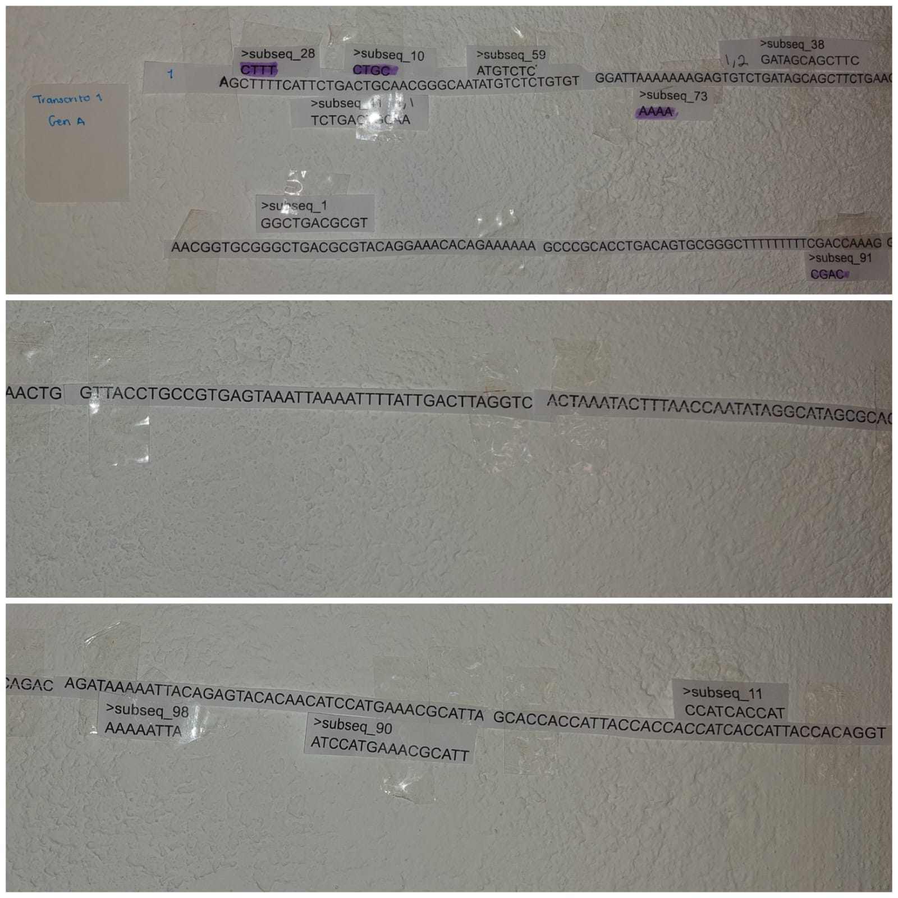
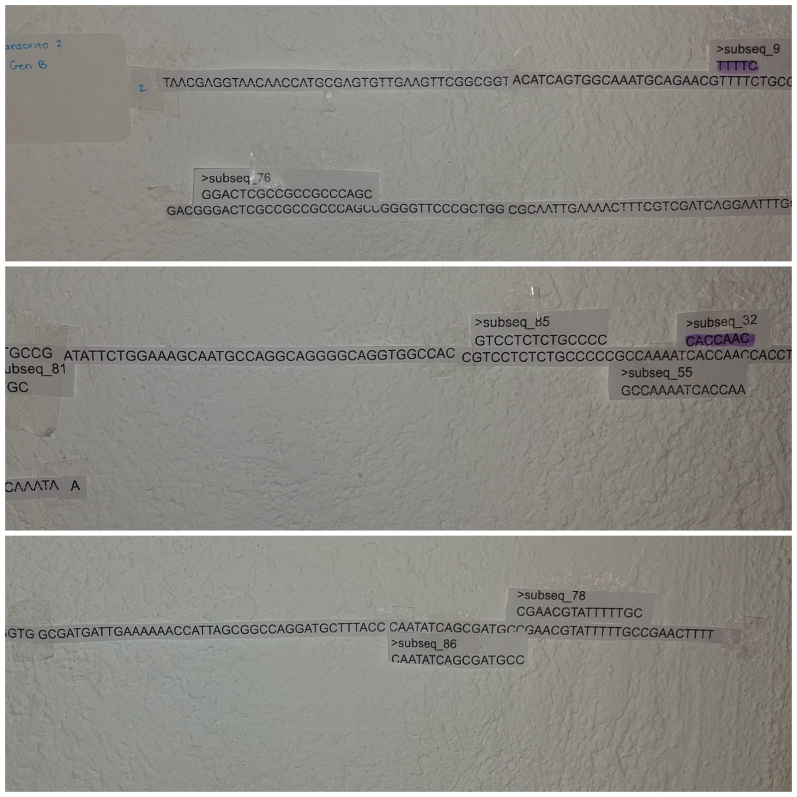
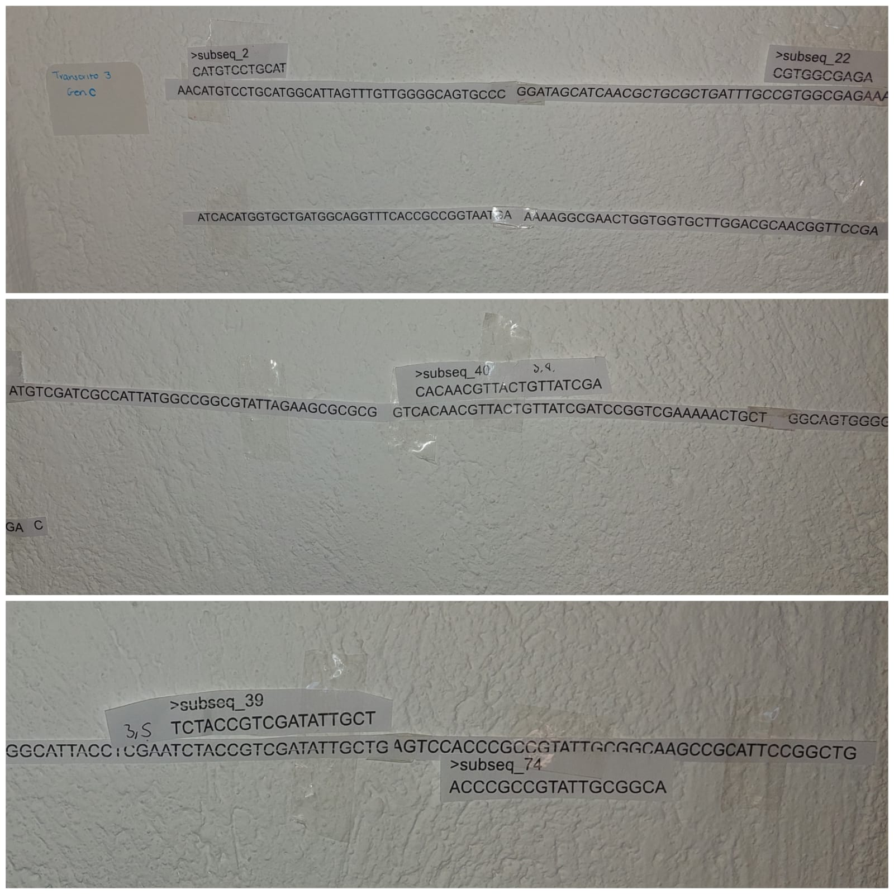
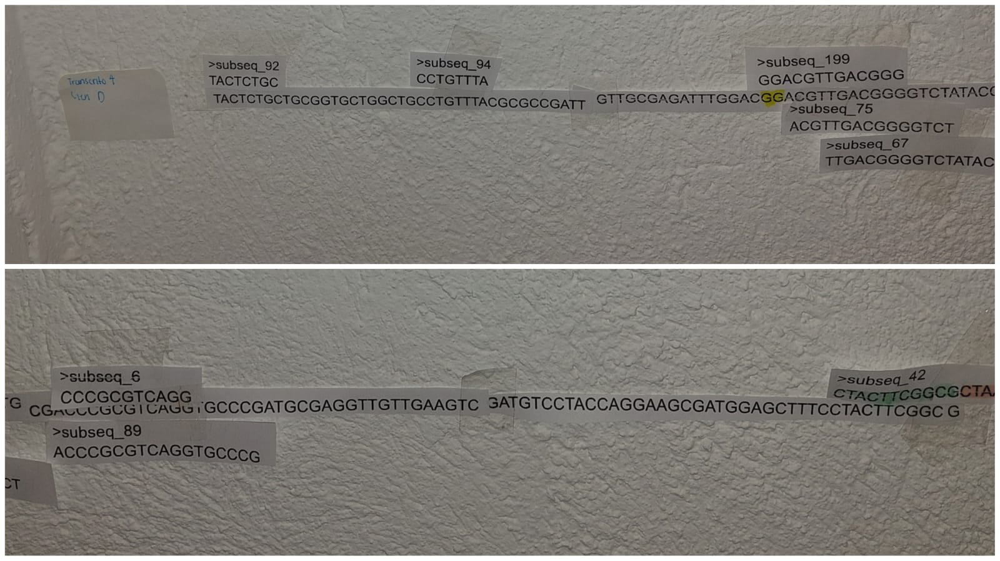

## Evidencia fotografica.

**Gen A.**\
{width="449"}\
**Figura 1.** En esta imagen se observa al gen A con su mapeo correspondiente.

**Gen B**\
{width="451"}\
**Figura 2** Mapeo del gen B.

**Gen C**\
{width="445"}\
**Figura 3** Mapeo del gen C

**Gen D**\
{width="475"}\
**Figura 4** Mapeo gen D.

**Gen E y Gen F**\
{width="483"}\
**Figura 5** Aqui se observa las secuencias de los genes E y F, los cuales tienen sus correspondientes secuencias mapeadas.

**Gen 7; vista general.**\
{width="548"}\
**Figura 6** En esta imagen se observa el gen 7. Transcrito G con el mapeo de secuencias.
