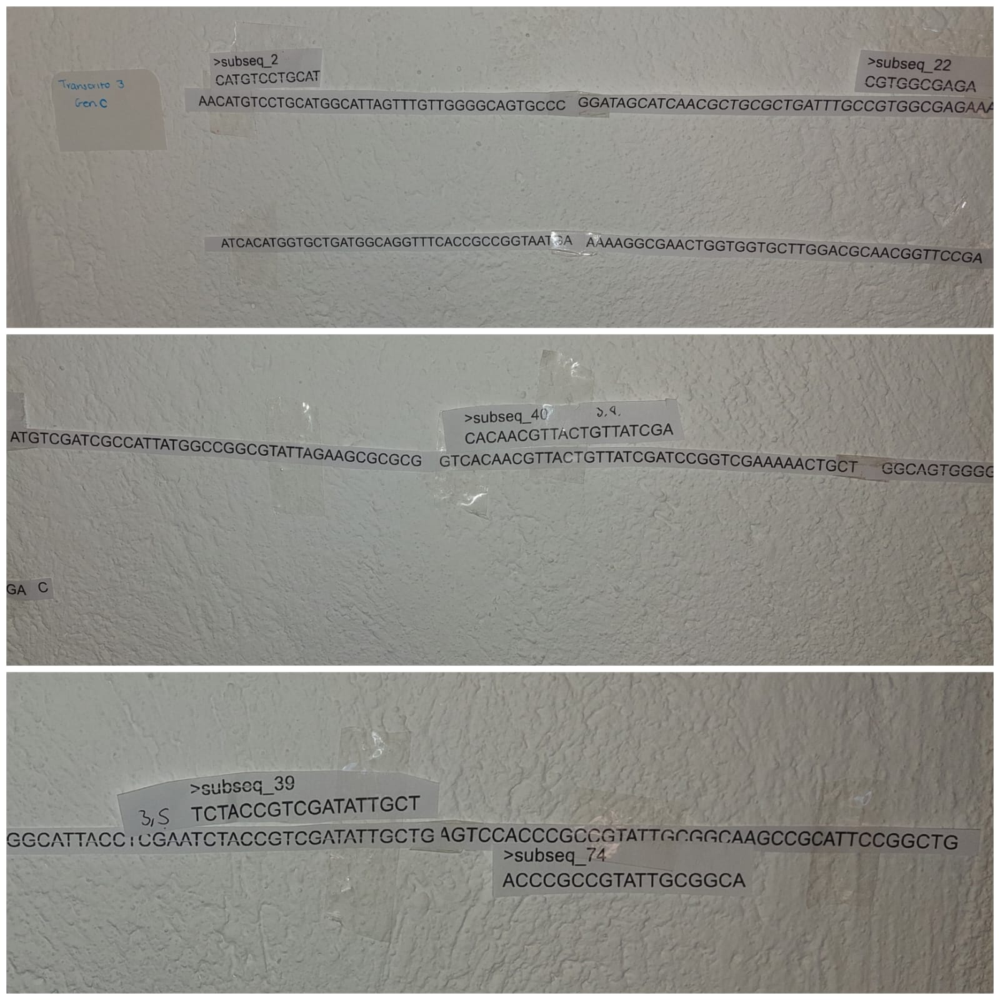
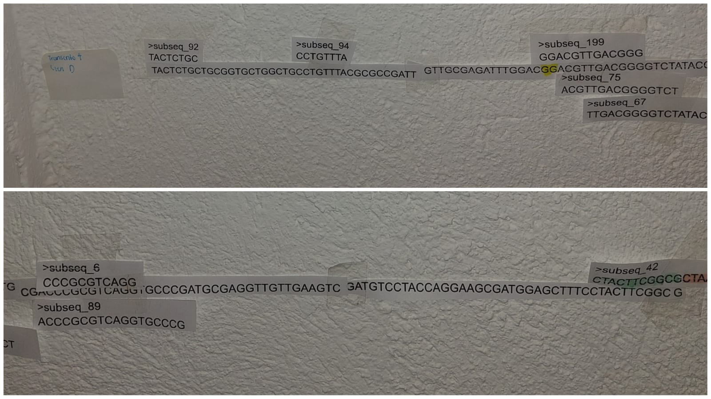

## Evidencia fotografica.

**Gen 1** 

**Gen 2** 

**Gen 3**

**Gen 4**

**Gen 5 y Gen 6; vista general.**

{width="447"}\
Aqui se observa las secuencias de los genes E y F, los cuales tienen sus correspondientes secuencias mapeadas.

**Gen 7; vista general.** {width="548"}\
En esta imagen se observa el gen 7. Transcrito G con el mapeo de secuencias.
